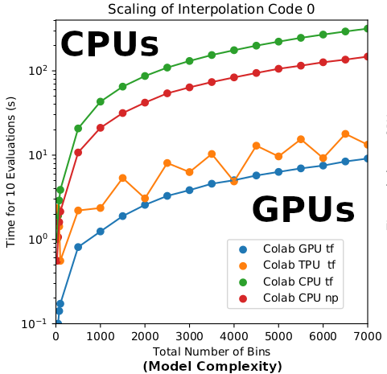
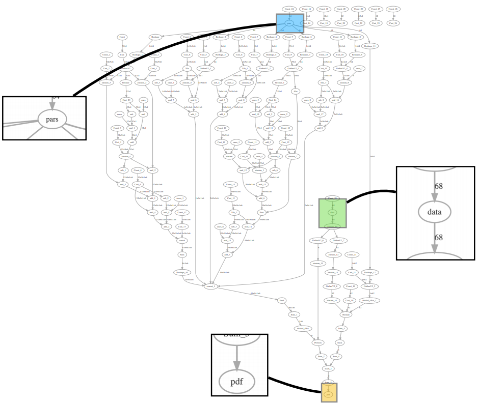
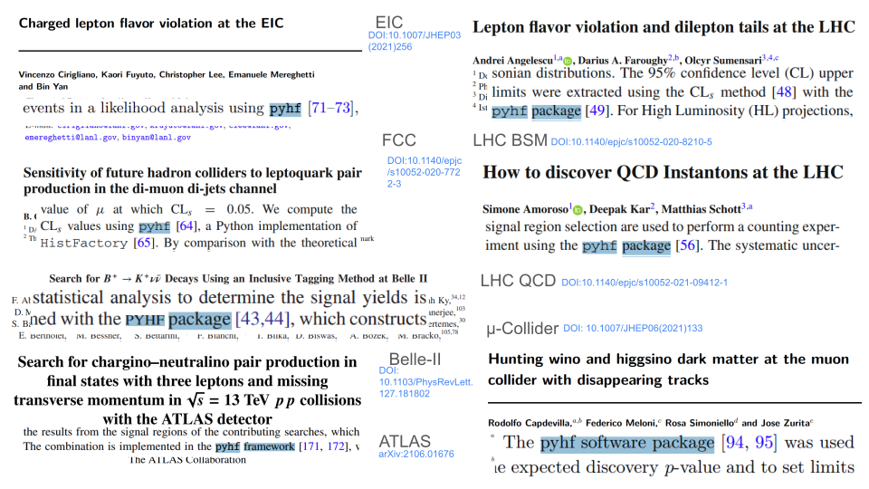
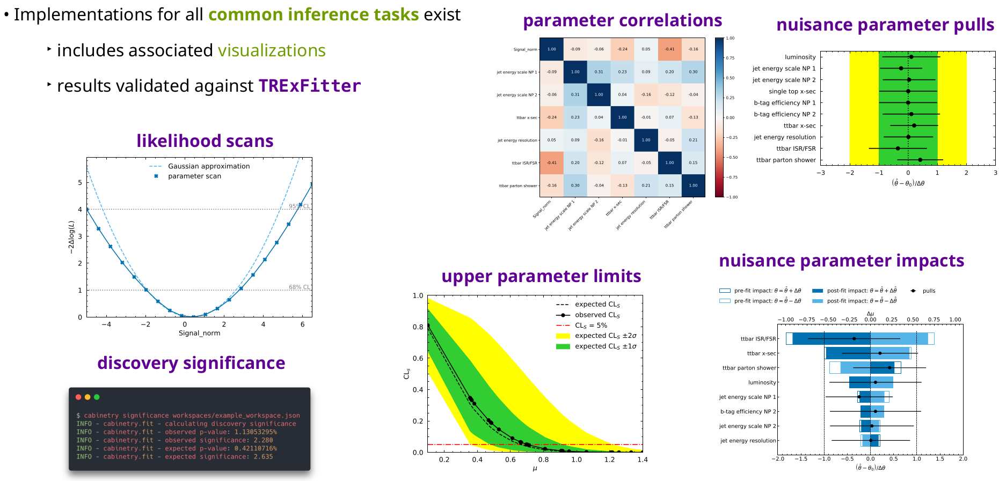
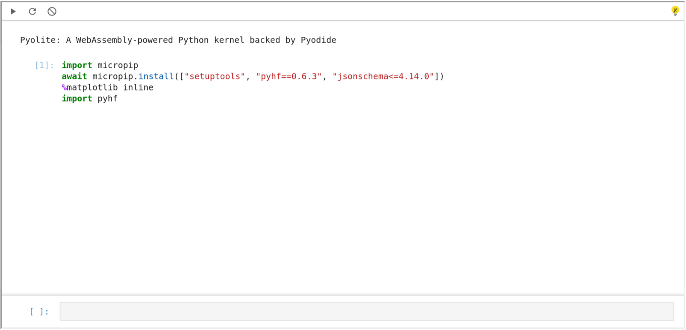
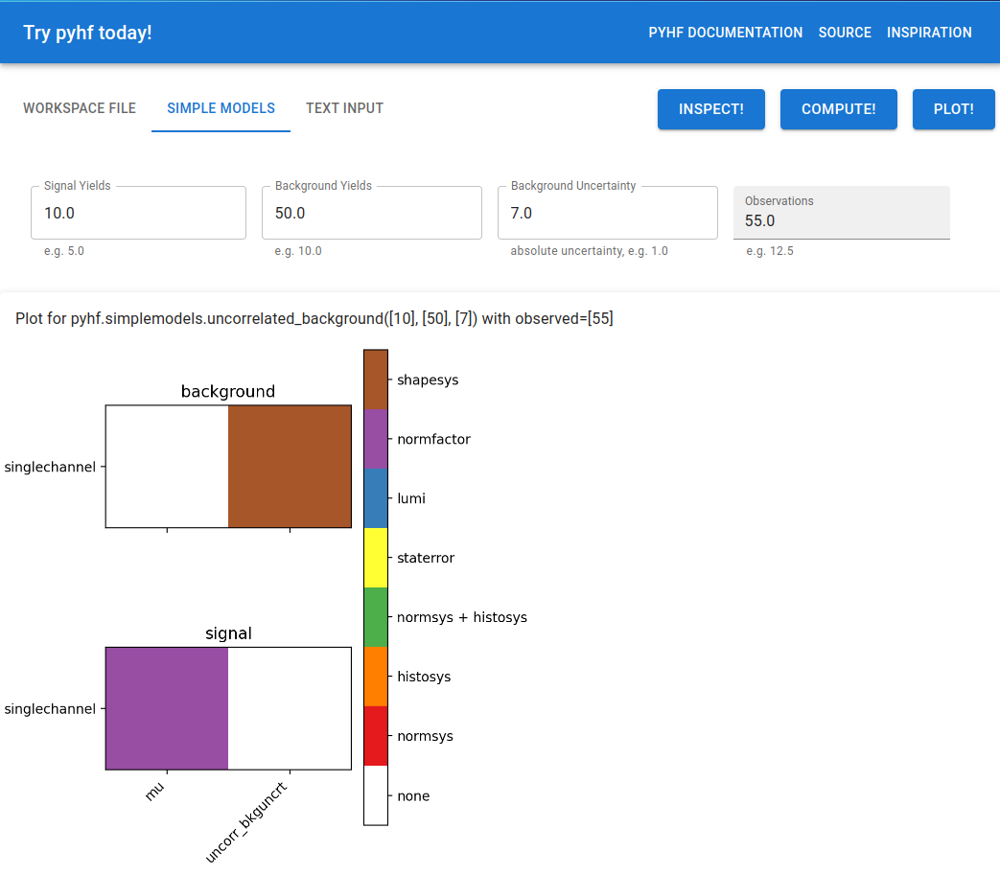

class: middle, center, title-slide
count: false

# `pyhf`: pure-Python implementation of HistFactory with tensors and automatic differentiation

.huge.blue[Matthew Feickert]<br>
.huge[(University of Wisconsin-Madison)]
<br><br>
[matthew.feickert@cern.ch](mailto:matthew.feickert@cern.ch)

[International Conference on High Energy Physics (ICHEP) 2022](https://agenda.infn.it/event/28874/contributions/169217/)

July 8th, 2022

<!-- ---
# Talk information
<br><br>

- .bold[talk time]: .bold[15 minute] presentation on pyhf
   - .bold[12 minutes] talk
   - .bold[3 minutes] questions
- .bold[talk upload]: The only accepted formats for the slides are pdf (preferred) or pptx, any other format is strictly
forbidden. The files must be uploaded to the Indico platform of the conference .bold[before 6 pm of the day before the talk], no other method of submission will be allowed. -->

---
# `pyhf` team

<br>

.grid[
.kol-1-3.center[
.circle.width-80[]

[Lukas Heinrich](https://github.com/lukasheinrich)

Technical University of Munich
]
.kol-1-3.center[
.circle.width-80[]

[Matthew Feickert](https://www.matthewfeickert.com/)

University of Wisconsin-Madison<br>
(Illinois for work presented today)
]
.kol-1-3.center[
.circle.width-75[]

[Giordon Stark](https://github.com/kratsg)

University of California Santa Cruz SCIPP
]
]

.center.large[plus more than 20 contributors]

---
# Goals of physics analysis at the LHC

.kol-1-1[
.kol-1-3.center[
.width-100[[](https://atlas.web.cern.ch/Atlas/GROUPS/PHYSICS/PAPERS/HIGG-2012-27/)]
Search for new physics
]
.kol-1-3.center[
<br>
.width-100[[](http://cms-results.web.cern.ch/cms-results/public-results/superseded/HIG-19-004/index.html)]

<br>
Make precision measurements
]
.kol-1-3.center[
.width-110[[](https://atlas.web.cern.ch/Atlas/GROUPS/PHYSICS/PAPERS/SUSY-2018-31/)]

Provide constraints on models through setting best limits
]
]

- All require .bold[building statistical models] and .bold[fitting models] to data to perform statistical inference
- Model complexity can be huge for complicated searches
- **Problem:** Time to fit can be .bold[many hours]
- .blue[Goal:] Empower analysts with fast fits and expressive models

---
# HistFactory Model

- A flexible probability density function (p.d.f.) template to build statistical models in high energy physics
- Developed in 2011 during work that lead to the Higgs discovery [[CERN-OPEN-2012-016](http://inspirehep.net/record/1236448)]
- Widely used by ATLAS for .bold[measurements of known physics] and .bold[searches for new physics]

.kol-2-5.center[
.width-90[[](https://atlas.web.cern.ch/Atlas/GROUPS/PHYSICS/PAPERS/HIGG-2016-25/)]
.bold[Standard Model]
]
.kol-3-5.center[
.width-100[[](https://atlas.web.cern.ch/Atlas/GROUPS/PHYSICS/PAPERS/SUSY-2016-16/)]
<br>.bold[Beyond the Standard Model]
]

<!-- If we look at the HistFactory model itself, we can see that it is comprised of two main parts.
This first part in blue if a produce of Poissons across all bins in all channels (which you can think of as analysis regions).
And then this second part in red are constraint terms.-->
---
# HistFactory Template: at a glance

<!-- \definecolor{data}{HTML}{00a620}
\definecolor{auxdata}{HTML}{a3130f}
\definecolor{freepars}{HTML}{0495fc}
\definecolor{conpars}{HTML}{9c2cfc} -->
$$
f\left(\mathrm{data}\middle|\mathrm{parameters}\right) =  f\left(\textcolor{#00a620}{\vec{n}}, \textcolor{#a3130f}{\vec{a}}\middle|\textcolor{#0495fc}{\vec{\eta}}, \textcolor{#9c2cfc}{\vec{\chi}}\right) = \textcolor{blue}{\prod\_{c \\,\in\\, \textrm{channels}} \prod\_{b \\,\in\\, \textrm{bins}\_c} \textrm{Pois} \left(n\_{cb} \middle| \nu\_{cb}\left(\vec{\eta}, \vec{\chi}\right)\right)} \\,\textcolor{red}{\prod\_{\chi \\,\in\\, \vec{\chi}} c\_{\chi} \left(a\_{\chi}\middle|\chi\right)}
$$

.center[$\textcolor{#00a620}{\vec{n}}$: .obsdata[events], $\textcolor{#a3130f}{\vec{a}}$: .auxdata[auxiliary data], $\textcolor{#0495fc}{\vec{\eta}}$: .freepars[unconstrained pars], $\textcolor{#9c2cfc}{\vec{\chi}}$: .conpars[constrained pars]]

$$
\nu\_{cb}(\textcolor{#0495fc}{\vec{\eta}}, \textcolor{#9c2cfc}{\vec{\chi}}) = \sum\_{s \\,\in\\, \textrm{samples}} \underbrace{\left(\sum\_{\kappa \\,\in\\, \vec{\kappa}} \kappa\_{scb}(\textcolor{#0495fc}{\vec{\eta}}, \textcolor{#9c2cfc}{\vec{\chi}})\right)}\_{\textrm{multiplicative}} \Bigg(\nu\_{scb}^{0}(\textcolor{#0495fc}{\vec{\eta}}, \textcolor{#9c2cfc}{\vec{\chi}}) + \underbrace{\sum\_{\Delta \\,\in\\, \vec{\Delta}} \Delta\_{scb}(\textcolor{#0495fc}{\vec{\eta}}, \textcolor{#9c2cfc}{\vec{\chi}})}\_{\textrm{additive}}\Bigg)
$$

.bold[Use:] Multiple disjoint _channels_ (or regions) of binned distributions with multiple _samples_ contributing to each with additional (possibly shared) systematics between sample estimates

.bold[Main pieces:]
- .blue[Main Poisson p.d.f. for simultaneous measurement of multiple channels]
- .katex[Event rates] $\nu\_{cb}(\textcolor{#0495fc}{\vec{\eta}}, \textcolor{#9c2cfc}{\vec{\chi}})$ (nominal rate $\nu\_{scb}^{0}$ with rate modifiers)
   - encode systematic uncertainties (e.g. normalization, shape)
- .red[Constraint p.d.f. (+ data) for "auxiliary measurements"]

<!-- If we look furthe we also see that the Poissons event rate parameters are nominal rates that are modified by additive and multipicitiv modifiers
which allow for encoding systematics, where some of the parameters of the event rates are also present in the contstraint terms -->
---
# HistFactory Template: at a second glance

<!-- \definecolor{data}{HTML}{00a620}
\definecolor{auxdata}{HTML}{a3130f}
\definecolor{freepars}{HTML}{0495fc}
\definecolor{conpars}{HTML}{9c2cfc} -->
$$
f\left(\mathrm{data}\middle|\mathrm{parameters}\right) =  f\left(\textcolor{#00a620}{\vec{n}}, \textcolor{#a3130f}{\vec{a}}\middle|\textcolor{#0495fc}{\vec{\eta}}, \textcolor{#9c2cfc}{\vec{\chi}}\right) = \prod\_{c \\,\in\\, \textrm{channels}} \prod\_{b \\,\in\\, \textrm{bins}\_c} \textrm{Pois} \left(\textcolor{#00a620}{n\_{cb}} \middle| \nu\_{cb}\left(\textcolor{#0495fc}{\vec{\eta}}, \textcolor{#9c2cfc}{\vec{\chi}}\right)\right) \\,\prod\_{\chi \\,\in\\, \vec{\chi}} c\_{\chi} \left(\textcolor{#a3130f}{a\_{\chi}}\middle|\textcolor{#9c2cfc}{\chi}\right)
$$

.center[$\textcolor{#00a620}{\vec{n}}$: .obsdata[events], $\textcolor{#a3130f}{\vec{a}}$: .auxdata[auxiliary data], $\textcolor{#0495fc}{\vec{\eta}}$: .freepars[unconstrained pars], $\textcolor{#9c2cfc}{\vec{\chi}}$: .conpars[constrained pars]]

$$
\nu\_{cb}(\textcolor{#0495fc}{\vec{\eta}}, \textcolor{#9c2cfc}{\vec{\chi}}) = \sum\_{s \\,\in\\, \textrm{samples}} \underbrace{\left(\sum\_{\kappa \\,\in\\, \vec{\kappa}} \kappa\_{scb}(\textcolor{#0495fc}{\vec{\eta}}, \textcolor{#9c2cfc}{\vec{\chi}})\right)}\_{\textrm{multiplicative}} \Bigg(\nu\_{scb}^{0}(\textcolor{#0495fc}{\vec{\eta}}, \textcolor{#9c2cfc}{\vec{\chi}}) + \underbrace{\sum\_{\Delta \\,\in\\, \vec{\Delta}} \Delta\_{scb}(\textcolor{#0495fc}{\vec{\eta}}, \textcolor{#9c2cfc}{\vec{\chi}})}\_{\textrm{additive}}\Bigg)
$$

.bold[Use:] Multiple disjoint _channels_ (or regions) of binned distributions with multiple _samples_ contributing to each with additional (possibly shared) systematics between sample estimates

.bold[Main pieces:]
- .blue[Main Poisson p.d.f. for simultaneous measurement of multiple channels]
- .katex[Event rates] $\nu\_{cb}(\textcolor{#0495fc}{\vec{\eta}}, \textcolor{#9c2cfc}{\vec{\chi}})$ (nominal rate $\nu\_{scb}^{0}$ with rate modifiers)
   - encode systematic uncertainties (e.g. normalization, shape)
- .red[Constraint p.d.f. (+ data) for "auxiliary measurements"]

<!-- So HistFactory gives us a concise mathematical grammar for a model across all channels
(which are analysis regions) and bins, with systematic uncertanties that modify the Poisson event rate,
which are coupled to sets of constraint terms, which all goes into a simultaneous fit.
 -->
---
# HistFactory Template: grammar

$$
f\left(\mathrm{data}\middle|\mathrm{parameters}\right) = f\left(\textcolor{#00a620}{\vec{n}}, \textcolor{#a3130f}{\vec{a}}\middle|\textcolor{#0495fc}{\vec{\eta}}, \textcolor{#9c2cfc}{\vec{\chi}}\right) = \textcolor{blue}{\prod\_{c \\,\in\\, \textrm{channels}} \prod\_{b \\,\in\\, \textrm{bins}\_c} \textrm{Pois} \left(n\_{cb} \middle| \nu\_{cb}\left(\vec{\eta}, \vec{\chi}\right)\right)} \\,\textcolor{red}{\prod\_{\chi \\,\in\\, \vec{\chi}} c\_{\chi} \left(a\_{\chi}\middle|\chi\right)}
$$

Mathematical grammar for a simultaneous fit with:

- .blue[multiple "channels"] (analysis regions, (stacks of) histograms) that can have multiple bins
- with systematic uncertainties that modify the event rate $\nu\_{cb}(\textcolor{#0495fc}{\vec{\eta}}, \textcolor{#9c2cfc}{\vec{\chi}})$
- coupled to a set of .red[constraint terms]
<!--  -->
.center.width-40[[](https://atlas.web.cern.ch/Atlas/GROUPS/PHYSICS/PAPERS/SUSY-2016-16/)]
.center[Example: .bold[Each bin] is separate (1-bin) _channel_, each .bold[histogram] (color)<br> is a _sample_ and share a .bold[normalization systematic] uncertainty]

---
# HistFactory Template: implementation

$$
f\left(\mathrm{data}\middle|\mathrm{parameters}\right) =  f\left(\textcolor{#00a620}{\vec{n}}, \textcolor{#a3130f}{\vec{a}}\middle|\textcolor{#0495fc}{\vec{\eta}}, \textcolor{#9c2cfc}{\vec{\chi}}\right) = \prod\_{c \\,\in\\, \textrm{channels}} \prod\_{b \\,\in\\, \textrm{bins}\_c} \textrm{Pois} \left(\textcolor{#00a620}{n\_{cb}} \middle| \nu\_{cb}\left(\textcolor{#0495fc}{\vec{\eta}}, \textcolor{#9c2cfc}{\vec{\chi}}\right)\right) \\,\prod\_{\chi \\,\in\\, \vec{\chi}} c\_{\chi} \left(\textcolor{#a3130f}{a\_{\chi}}\middle|\textcolor{#9c2cfc}{\chi}\right)
$$

.center[$\textcolor{#00a620}{\vec{n}}$: .obsdata[events], $\textcolor{#a3130f}{\vec{a}}$: .auxdata[auxiliary data], $\textcolor{#0495fc}{\vec{\eta}}$: .freepars[unconstrained pars], $\textcolor{#9c2cfc}{\vec{\chi}}$: .conpars[constrained pars]]

$$
\nu\_{cb}(\textcolor{#0495fc}{\vec{\eta}}, \textcolor{#9c2cfc}{\vec{\chi}}) = \sum\_{s \\,\in\\, \textrm{samples}} \underbrace{\left(\sum\_{\kappa \\,\in\\, \vec{\kappa}} \kappa\_{scb}(\textcolor{#0495fc}{\vec{\eta}}, \textcolor{#9c2cfc}{\vec{\chi}})\right)}\_{\textrm{multiplicative}} \Bigg(\nu\_{scb}^{0}(\textcolor{#0495fc}{\vec{\eta}}, \textcolor{#9c2cfc}{\vec{\chi}}) + \underbrace{\sum\_{\Delta \\,\in\\, \vec{\Delta}} \Delta\_{scb}(\textcolor{#0495fc}{\vec{\eta}}, \textcolor{#9c2cfc}{\vec{\chi}})}\_{\textrm{additive}}\Bigg)
$$

.center[.bold[This is a _mathematical_ representation!] Nowhere is any software spec defined]
.center[.bold[Until 2018] the only implementation of HistFactory has been in [`ROOT`](https://root.cern.ch/)]

.center.width-70[[](https://root.cern/doc/v624/group__HistFactory.html)]

---
# `pyhf`: HistFactory in pure Python
<!--  -->
.kol-1-2.large[
- First non-ROOT implementation of the HistFactory p.d.f. template
   - .width-40[[](https://doi.org/10.5281/zenodo.1169739)]
- pure-Python library as second implementation of HistFactory
  - [`$ python -m pip install pyhf`](https://scikit-hep.org/pyhf/installation.html#install-from-pypi)
  - No dependence on ROOT!

.center.width-100[[](https://pypi.org/project/pyhf/)]
]
.kol-1-2.large[
- Open source tool for all of HEP
   - [IRIS-HEP](https://iris-hep.org/projects/pyhf.html) supported Scikit-HEP project
   - Used in ATLAS SUSY, Exotics, and Top groups in [22 published analyses](https://scikit-hep.org/pyhf/citations.html#published-statistical-models) (inference and published models)
   - Used by Belle II<br>(DOI: [10.1103/PhysRevLett.127.181802](https://inspirehep.net/literature/1860766))
   - Used in [analyses and for reinterpretation](https://scikit-hep.org/pyhf/citations.html#use-citations) by phenomenology community, `SModelS` <br>(DOI: [10.1016/j.cpc.2021.107909](https://inspirehep.net/literature/1814793)), and `MadAnalysis 5` ([arXiv:2206.14870](https://inspirehep.net/literature/2103971))
   - Ongoing [IRIS-HEP supported Fellow](https://iris-hep.org/fellows/peterridolfi.html) work to provide conversion support to CMS Combine as of Summer 2022!
]

<!-- Same slide but with release candidate shown -->
---
# `pyhf`: HistFactory in pure Python
<!--  -->
.kol-1-2.large[
- First non-ROOT implementation of the HistFactory p.d.f. template
   - .width-40[[](https://doi.org/10.5281/zenodo.1169739)]
- pure-Python library as second implementation of HistFactory
  - [`$ python -m pip install --pre pyhf`](https://scikit-hep.org/pyhf/installation.html#install-from-pypi)
  - No dependence on ROOT!

.center.width-100[[](https://pypi.org/project/pyhf/0.7.0rc1/)]
]
.kol-1-2.large[
- Open source tool for all of HEP
   - [IRIS-HEP](https://iris-hep.org/projects/pyhf.html) supported Scikit-HEP project
   - Used in ATLAS SUSY, Exotics, and Top groups in [22 published analyses](https://scikit-hep.org/pyhf/citations.html#published-statistical-models) (inference and published models)
   - Used by Belle II<br>(DOI: [10.1103/PhysRevLett.127.181802](https://inspirehep.net/literature/1860766))
   - Used in [analyses and for reinterpretation](https://scikit-hep.org/pyhf/citations.html#use-citations) by phenomenology community, `SModelS` <br>(DOI: [10.1016/j.cpc.2021.107909](https://inspirehep.net/literature/1814793)), and `MadAnalysis 5` ([arXiv:2206.14870](https://inspirehep.net/literature/2103971))
   - Ongoing [IRIS-HEP supported Fellow](https://iris-hep.org/fellows/peterridolfi.html) work to provide conversion support to CMS Combine as of Summer 2022!
]

<!-- pyhf support multiple tensor libraries like NumPy, PyTorch, TensorFlow, and JAX as computational backends to impliment n-dimensional
array operations through a common API.
These last three are machine learning libraries and allow for explotation of automatic differentiaion and hardware acceleration.
Additionally, as there is huge buy in from industry to all of these libraries they are maintained by professional software engineers, which
most physics anlaysts are not.
In terms of hardware acceleration, this somwhat old plot on the left shows that for the interpolation proceedures for systematics hardware accleration
can have a substantial impact for models with large complexity.
However, as there is associated overhead with placing models on the GPU this means that for smaller models this is sometimes not beneficial.
But there are instances that we've seen for large complex models where the time to fit has moved from hours to minutes, which can be quite useful.
-->
---
# Machine Learning Frameworks for Computation

.grid[
.kol-2-3[
- All numerical operations implemented in .bold[tensor backends] through an API of $n$-dimensional array operations
- Using deep learning frameworks as computational backends allows for .bold[exploitation of auto differentiation (autograd) and GPU acceleration]
- As huge buy in from industry we benefit for free as these frameworks are .bold[continually improved] by professional software engineers (physicists are not)

.kol-1-2.center[
.width-80[]
]
.kol-1-2[
- Hardware acceleration giving .bold[order of magnitude speedup] in interpolation for systematics!
   - does suffer some overhead
- Noticeable impact for large and complex models
   - hours to minutes for fits
]
]
.kol-1-4.center[
.width-85[]
.width-85[]
.width-85[]

<br>
.width-50[]
]
]

<!-- In addition to the vectorization and acceleration provided by these tensor libraries, another important factor to fitting speeds has
been automatic differentiation of the likelihood. The computational backends are able to setup a computational grpah that can propagate the
gradient through the full calculation which then can provide the full graidnent to modern optimizers which can significantly speed up fits.-->
---
# Automatic differentiation

With tensor library backends gain access to _exact (higher order) derivatives_ &mdash; accuracy is only limited by floating point precision

$$
\frac{\partial L}{\partial \mu}, \frac{\partial L}{\partial \theta_{i}}
$$

.grid[
.kol-1-2[
.large[Exploit .bold[full gradient of the likelihood] with .bold[modern optimizers] to help speedup fit!]

<br><br>
.large[Gain this through the frameworks creating _computational directed acyclic graphs_ and then applying the chain rule (to the operations)]
]
.kol-1-2[
.center.width-80[]
]
]

<!-- Another important feature about pyhf is that the model specification is in JSON.
This gives us a human and machine readable delcarative spec, and as JSON is everywhere and will be with us until the
heat death of the Universe we have long term support baked in as well.
It is additionally parsable by every language, and so is highly portable and is easily versioned, compressed, and preserved.
It can also be patched which allows for interesting applications in analysis reinterpretation.
With pyhf's CLI API we also support bi-directional translations with ROOT. -->
---
# JSON spec fully describes the HistFactory model

.kol-1-4.width-100[
- Human & machine readable .bold[declarative] statistical models
- Industry standard
   - Will be with us forever
- Parsable by every language
   - Highly portable
   - Bidirectional translation <br>with ROOT
- Versionable and easily preserved
   - JSON Schema [describing<br> HistFactory specification](https://scikit-hep.org/pyhf/likelihood.html#bibliography)
   - Attractive for analysis preservation
   - Highly compressible
]
.kol-3-4.center[
.width-105[]

.center[[`JSON` defining a single channel, two bin counting experiment with systematics](https://scikit-hep.org/pyhf/likelihood.html#toy-example)]
]

<!-- Once pyhf was established and sufficiently feature complete, ATLAS released a PUB note in 2019 that validated it by reproducing
a published SUSY search for bottom squarks to well within uncertanties.
Using pyhf's JSON specification for HistFactory models ATLAS additionally published the full probability model for all mass hypotheses
in the analysis to HEPData.
This was the first full probabiliy model ever published by an LHC experiment, as noted in this CERN article from 2020, and ATLAS has now gone on to
publish 22 full probabiliy models.-->
---
# ATLAS validation and publication of models

.kol-1-2[
.center.width-100[[](https://cds.cern.ch/record/2684863)]

.center.width-90[[](https://cds.cern.ch/record/2684863)]

<br>
.center[(ATLAS, 2019)]
]
.kol-1-2[
.center.width-100[[](https://home.cern/news/news/knowledge-sharing/new-open-release-allows-theorists-explore-lhc-data-new-way)]
.center[(CERN, 2020)]
]

---
# Large community adoption followed (2020 on)
<!-- Following the validation and publication of the first full probabiliyt model, there has been a large uptick in community adoption since 2020.
This slide shows a collection of the 32 use citations that pyhf has recieved from a variety of theory and experiment papers and publications,
including several ATLAS publications and a publication from Belle II.
This has been exciting to see as we feel that having open community tooling across theory and experiment is important for clear communication.
-->
.center[
.width-95[[](https://scikit-hep.org/pyhf/citations.html)]
]

<!-- Focusing on this idea of community use and involvement, it is important to emphasize that pyhf is a **library** focused on modeling
and inference and not a framework. As part of the Scikit-HEP ecosystem, pyhf's API was designed to be extensible which has allowed for
libraries like cabinetry to use pyhf as an inference engine.
cabinetry is a library that allows for building and steering profile likelihood fits and supports APIs for common inferenece tasks and
visualization in analysis.
cabinery is a great example of using pyhf to build tools that meet the needs of users while still benefitting from improvements to pyhf releases. -->
---
# Extending and visualization: cabinetry

.kol-1-3[
<br>
- .bold[pyhf] focuses on the modeling (library not a framework)
- Leverage the design of the .bold[Scikit-HEP ecosystem] and close communication between pyhf dev team and cabinetry lead dev Alexander Held
- .bold[cabinetry] designs & steers template profile likelihood fits
- Uses pyhf as the inference engine
- Provides common visualization for inference validation
]
.kol-2-3[
.center.width-50[[](https://github.com/scikit-hep/cabinetry)]
.center.width-100[[](https://indico.cern.ch/event/1056428/contributions/4523825/)]

.center[Alexander Held, [ATLAS SUSY Workshop 2021](https://indico.cern.ch/event/1056428/contributions/4523825/)]
]

<!-- Keeping on this theme of uses in communities, both pyhf and cabinetry are components of the IRIS-HEP Analysis Systems pipeline which
is a substrate of analysis techoogies.
Given the interoparable design this allows for pyhf to plugin and be used in deployment as a tool to reduce the time to insight and
inference and when pyhf's JSON spec that allows for patching of signal models is combined with techologies like RECAST it becomes an
enabling techology for reinterpreation as well. -->
---
# Core part of IRIS-HEP Analysis Systems pipeline
.center[
.width-65[[](https://iris-hep.org/as.html)]
]
- .large[Analysis Systems pipeline: deployable stack of experiment agnostic infrastructure]
   - c.f. demonstration at [IRIS-HEP Analysis Grand Challenge Tools Workshop 2022](https://indico.cern.ch/event/1126109/contributions/4780156/)
- .large[Accelerating fitting (reducing time to .bold[insight] (statistical inference)!)] (`pyhf` + `cabinetry`)
- .large[An enabling technology for .bold[reinterpretation]] (`pyhf` + RECAST)

<!-- Finally, in thinking into the future about how pyhf can be deployed in non-traditional situations, here's an example of using pyhf natively
in the browser.
This slide shows the Pyodide CPython port into WebAssembly running natively in my web browser with an interface exposed by the Jupyterlite kernel.
With Pyodidie the full scientific Python stack (NumPy, SciPy, matplotlib) is supported which allows for things like pyhf to be natively installed
from PyPI inside the browser.
This means that we can directly copy an intro example from the pyhf documentation, and paste it into Jupyterlite, which when evaluated performs an
upper limit scan which was run natively on the client side browser.-->
---
# Browser native ecosystem as of April 2022

.center.width-100[
<iframe
   src="https://jupyterlite.github.io/demo/repl/index.html?kernel=python&toolbar=1&code=import%20piplite%0Aawait%20piplite.install%28%5B%22pyhf%3D%3D0.6.3%22%2C%20%22requests%22%5D%29%0A%25matplotlib%20inline%0Aimport%20pyhf"
   width="100%"
   height="500px"
></iframe>
]

.center[[Pyodide](https://pyodide.org/en/stable/) CPython port to WebAssembly/Emscripten powering [JupyterLite](https://jupyterlite.readthedocs.io/) kernel]

---
# Browser native ecosystem as of April 2022

.center.width-100[]

.center[[Pyodide](https://pyodide.org/en/stable/) CPython port to WebAssembly/Emscripten powering [JupyterLite](https://jupyterlite.readthedocs.io/) kernel]

---
# Browser native ecosystem as of April 2022

.center.width-100[]

.center[[Pyodide](https://pyodide.org/en/stable/) CPython port to WebAssembly/Emscripten powering [JupyterLite](https://jupyterlite.readthedocs.io/) kernel]

---
# Browser native ecosystem as of April 2022

.center.width-100[]

.center[[Pyodide](https://pyodide.org/en/stable/) CPython port to WebAssembly/Emscripten powering [JupyterLite](https://jupyterlite.readthedocs.io/) kernel]

<!-- try-pyhf slide -->
<!-- Now to be clear, I'm not suggesting or advocating that you run your physics analysis in the browser.
However, what I am saying is that when combined with the PyScript framework for creating full web native applications with HTML and Pyodide
(As it is fully client side, you can think of it very broadly as replacing JavaScript with WASM CPython.) there is an opportunity
for creating tools for training, for web appliations, and validation that is all done natively with Python.
For example, this "try-pyhf" example application that Giordon Stark made allows for a user to take any valid HistFactory model and
inspect its model components, perform simple inference tasks, and visualize the model parameters and assocaited modifiers.
This was all written using pyhf and simple HTML.
-->
---
# Enabling full web apps with PyScript

.center.width-55[[](https://kratsg.github.io/try-pyhf/)]
<!--  -->
.center[Future software/statistics training, web applications, schemea validation enabled with [Pyodide](https://pyodide.org/en/stable/) and [PyScript](https://pyscript.net/)]

---
# Enabling full web apps with PyScript

.center.width-55[[](https://kratsg.github.io/try-pyhf/)]
<!--  -->
.center[Future software/statistics training, web applications, schemea validation enabled with [Pyodide](https://pyodide.org/en/stable/) and [PyScript](https://pyscript.net/)]

---
# Enabling full web apps with PyScript

.center.width-55[[](https://kratsg.github.io/try-pyhf/)]
<!--  -->
.center[Future software/statistics training, web applications, schemea validation enabled with [Pyodide](https://pyodide.org/en/stable/) and [PyScript](https://pyscript.net/)]

<!-- And finally I think this area is exciting when combined with the timing that HEPData now further supports HistFactory JSON.
HEPData entries that include a HistFactory JSON model now recieve a HistFactory badge and the model itself gets a unique DOI.
So a big thanks to the HEPData team for this work and the pyhf team is looking forward to working with HEPData to investiage if there
are ways to add visualization and interactivity for models to HEPData without encumbering the service. -->
---
# HEPData support for HistFactory JSON and more

.kol-2-7[
<br><br><br><br><br><br><br>
.center.width-100[[](https://twitter.com/HEPData/status/1529038702344798212)]
]
.kol-5-7[
<br>
.center.width-100[[](https://www.hepdata.net/search/?q=analysis:HistFactory)]
]

.center[Published HistFactory probability models get own DOI (future: model render, interactivity)]

---
# Summary
.kol-2-3[
- .large[Library for modeling and .bold[accelerated] fitting]
   - reducing time to insight/inference!
   - Hardware acceleration on GPUs and vectorized operations
   - Backend agnostic Python API and CLI
- .large[Flexible .bold[declarative] schema]
   - JSON: ubiquitous, universal support, versionable
- .large[Enabling technology for .bold[reinterpretation]]
   - JSON Patch files for efficient computation of new signal models
   - Unifying tool for theoretical and experimental physicists
- .large[Growing use community across .bold[all of HEP]]
   - Theory and experiment
- .large[Project in growing .bold[Pythonic HEP ecosystem]]
   - [Openly developed on GitHub](https://github.com/scikit-hep/pyhf) and welcome contributions
   - [Comprehensive open tutorials](https://pyhf.github.io/pyhf-tutorial/)
]
.kol-1-3[
<br>
<br>
<br>
.center.width-100[[](https://github.com/scikit-hep/pyhf)]
]

---
class: middle

.center[
# Thanks for listening!
# Come talk with us!

.large[[www.scikit-hep.org/pyhf](https://scikit-hep.org/pyhf/)]
]
.grid[
.kol-1-3.center[
.width-90[[](https://scikit-hep.org/)]
]
.kol-1-3.center[
<br>
.width-90[[](https://github.com/scikit-hep/pyhf)]
]
.kol-1-3.center[
<br>
<br>
.width-100[[](https://iris-hep.org/)]
]
]

---
class: end-slide, center

Backup

---
# Why is the likelihood important?

.kol-1-2.width-90[
<br>
- High information-density summary of analysis
- Almost everything we do in the analysis ultimately affects the likelihood and is encapsulated in it
   - Trigger
   - Detector
   - Combined Performance / Physics Object Groups
   - Systematic Uncertainties
   - Event Selection
- Unique representation of the analysis to reuse and preserve
]
.kol-1-2.width-100[
<br><br>
[](https://indico.cern.ch/event/839382/contributions/3521168/)
]

---
# HistFactory Template: systematic uncertainties

.kol-4-7[
- In HEP common for systematic uncertainties to be specified with two template histograms: "up" and "down" variation for parameter $\theta \in \\{\textcolor{#0495fc}{\vec{\eta}}, \textcolor{#9c2cfc}{\vec{\chi}} \\}$
   - "up" variation: model prediction for $\theta = +1$
   - "down" variation: model prediction for $\theta = -1$
   - Interpolation and extrapolation choices provide .bold[model predictions $\nu(\vec{\theta}\,)$ for any $\vec{\theta}$]
<!--  -->
- [Constraint terms](https://pyhf.readthedocs.io/en/v0.6.3/intro.html#id25) $c\_{j} \left(\textcolor{#a3130f}{a\_{j}}\middle|\textcolor{#9c2cfc}{\theta_{j}}\right)$ used to model auxiliary measurements. Example for Normal (most common case):
   - Mean of nuisance parameter $\textcolor{#9c2cfc}{\theta_{j}}$ with normalized width ($\sigma=1$)
   - Normal: auxiliary data $\textcolor{#a3130f}{a\_{j} = 0}$ (aux data function of modifier type)
   - Constraint term produces penalty in likelihood for pulling $\textcolor{#9c2cfc}{\theta_{j}}$ away from auxiliary measurement value
   - As $\nu(\vec{\theta}\,)$ constraint terms inform rate modifiers (.bold[systematic uncertainties]) during simultaneous fit
]
.kol-3-7[
.center.width-70[[](https://indico.cern.ch/event/1076231/contributions/4560405/)]
.center[Image credit: [Alexander Held](https://indico.cern.ch/event/1076231/contributions/4560405/)]
]

---
# Full likelihood serialization...

.center[...making good on [19 year old agreement to publish likelihoods](https://indico.cern.ch/event/746178/contributions/3396797/)]

.center.width-90[
[](https://cds.cern.ch/record/411537)
]

.center[([1st Workshop on Confidence Limits, CERN, 2000](http://inspirehep.net/record/534129))]

.bold[This hadn't been done in HEP until 2019]
- In an "open world" of statistics this is a difficult problem to solve
- What to preserve and how? All of ROOT?
- Idea: Focus on a single more tractable binned model first

---
# JSON Patch for signal model (reinterpretation)
<!--  -->
.center[JSON Patch gives ability to .bold[easily mutate model]]
.center[Think: test a .bold[new theory] with a .bold[new patch]!]
.center[(c.f. [Lukas Heinrich's RECAST talk from Snowmass 2021 Computational Frontier Workshop](https://indico.fnal.gov/event/43829/contributions/193817/))]
<br>
.center[Combined with RECAST gives powerful tool for .bold[reinterpretation studies]]
<!--  -->
.kol-1-5[
<br>
<br>
<br>
<br>
.center.width-100[]
.center[Signal model A]
]
.kol-3-5[
<!-- Using Perl style in Carbon -->
.center.width-100[]
]
.kol-1-5[
<br>
<br>
<br>
<br>
.center.width-100[]
.center[Signal model B]
]

---
# Probability models reserved on HEPData

- `pyhf` pallet:
   - Background-only model JSON stored
   - Hundreds of signal model JSON Patches stored together as a [`pyhf` "patch set" file](https://scikit-hep.org/pyhf/_generated/pyhf.patchset.PatchSet.html)
- Fully preserve and publish the full statistical model and observations to give likelihood
   - with own DOI! .width-20[[](https://doi.org/10.17182/hepdata.90607.v3/r3)]

.kol-3-5[
[.center.width-100[]](https://www.hepdata.net/record/ins1755298)
]
.kol-2-5[
<br>
.center.width-85[[](https://www.hepdata.net/record/ins1755298)]
]

---
# ...can be used from HEPData

- `pyhf` pallet:
   - Background-only model JSON stored
   - Hundreds of signal model JSON Patches stored together as a [`pyhf` "patch set" file](https://scikit-hep.org/pyhf/_generated/pyhf.patchset.PatchSet.html)
- Fully preserve and publish the full statistical model and observations to give likelihood
   - with own DOI! .width-20[[](https://doi.org/10.17182/hepdata.90607.v3/r3)]

.center.width-90[]

---
# API Example: Hypothesis test

.smaller[
```console
$ python -m pip install pyhf[jax,contrib]
$ pyhf contrib download https://doi.org/10.17182/hepdata.90607.v3/r3 1Lbb-pallet
```
```python
import json
import pyhf

pyhf.set_backend("jax")  # Optional for speed
spec = json.load(open("1Lbb-pallet/BkgOnly.json"))
patchset = pyhf.PatchSet(json.load(open("1Lbb-pallet/patchset.json")))

workspace = pyhf.Workspace(spec)
model = workspace.model(patches=[patchset["C1N2_Wh_hbb_900_250"]])

test_poi = 1.0
data = workspace.data(model)
cls_obs, cls_exp_band = pyhf.infer.hypotest(
    test_poi, data, model, test_stat="qtilde", return_expected_set=True
)
print(f"Observed CLs: {cls_obs}")
# Observed CLs: 0.4573416902360917
print(f"Expected CLs band: {[exp.tolist() for exp in cls_exp_band]}")
# Expected CLs band: [0.014838293214187472, 0.05174259485911152,
# 0.16166970886709053, 0.4097850957724176, 0.7428200727035176]
```
]

---
# Python API Example: Upper limit

.kol-3-5[
.tiny[
```console
$ python -m pip install pyhf[jax,contrib]
$ pyhf contrib download https://doi.org/10.17182/hepdata.90607.v3/r3 1Lbb-pallet
```
```python
import json
import matplotlib.pyplot as plt
import numpy as np
import pyhf
from pyhf.contrib.viz.brazil import plot_results

pyhf.set_backend("jax")  # Optional for speed

spec = json.load(open("1Lbb-pallet/BkgOnly.json"))
patchset = pyhf.PatchSet(json.load(open("1Lbb-pallet/patchset.json")))

workspace = pyhf.Workspace(spec)
model = workspace.model(patches=[patchset["C1N2_Wh_hbb_900_250"]])

test_pois = np.linspace(0, 5, 41)  # POI step of 0.125
data = workspace.data(model)
obs_limit, exp_limits, (test_pois, results) = pyhf.infer.intervals.upperlimit(
    data, model, test_pois, return_results=True
)

print(f"Observed limit: {obs_limit}")
# Observed limit: 2.547958147632675
print(f"Expected limits: {[limit.tolist() for limit in exp_limits]}")
# Expected limits: [0.7065311975182036, 1.0136453820160332,
# 1.5766626372587724, 2.558234487679955, 4.105381941514062]

fig, ax = plt.subplots()
artists = plot_results(test_pois, results, ax=ax)
fig.savefig("upper_limit.pdf")
```
]
]
<br><br>
.kol-2-5[
.center.width-100[]
]

---
# API Example: Extend with cabinetry
.kol-5-7[
.tiny[
```python
import json
import cabinetry
import pyhf
from cabinetry.model_utils import prediction
from pyhf.contrib.utils import download

# download the ATLAS bottom-squarks analysis probability models from HEPData
download("https://www.hepdata.net/record/resource/1935437?view=true", "bottom-squarks")

# construct a workspace from a background-only model and a signal hypothesis
bkg_only_workspace = pyhf.Workspace(
    json.load(open("bottom-squarks/RegionC/BkgOnly.json"))
)
patchset = pyhf.PatchSet(json.load(open("bottom-squarks/RegionC/patchset.json")))
workspace = patchset.apply(bkg_only_workspace, "sbottom_600_280_150")

# construct the probability model and observations
model, data = cabinetry.model_utils.model_and_data(workspace)

# produce visualizations of the pre-fit model and observed data
prefit_model = prediction(model)
cabinetry.visualize.data_mc(prefit_model, data)

# fit the model to the observed data
fit_results = cabinetry.fit.fit(model, data)

# produce visualizations of the post-fit model and observed data
postfit_model = prediction(model, fit_results=fit_results)
cabinetry.visualize.data_mc(postfit_model, data)
```
]
]
.kol-2-7.center[
.center.width-90[]
.center.width-90[]
]

---
# Rapid adoption in ATLAS...
<!--  -->
.kol-1-3[
- **22** ATLAS SUSY, Exotics, Top analyses with full probability models published to HEPData
- ATLAS SUSY will be continuing to publish full Run 2 likelihoods
]
.kol-2-3[
- direct staus, [doi:10.17182/hepdata.89408](https://doi.org/10.17182/hepdata.89408) (2019)
- sbottom multi-b, [doi:10.17182/hepdata.91127](https://doi.org/10.17182/hepdata.91127) (2019)
- 1Lbb, [doi:10.17182/hepdata.92006](https://doi.org/10.17182/hepdata.92006) (2019)
- 3L eRJR, [doi:10.17182/hepdata.90607](https://doi.org/10.17182/hepdata.90607) (2020)
- ss3L search, [doi:10.17182/hepdata.91214](https://doi.org/10.17182/hepdata.91214) (2020)
]
.kol-1-1[
.kol-1-1[
.kol-1-2[
.center.width-70[[](https://indico.cern.ch/event/905793/contributions/3811068/)]
]
.kol-1-2[
.center.width-70[[](https://indico.cern.ch/event/905793/contributions/3811068/)]
]
]
.center.smaller[SUSY [EWK 3L RPV](https://atlas.cern/updates/physics-briefing/fantastic-decays-and-where-find-them) analysis ([ATLAS-CONF-2020-009](https://atlas.web.cern.ch/Atlas/GROUPS/PHYSICS/CONFNOTES/ATLAS-CONF-2020-009/)): Exclusion curves as a function of mass and branching fraction to $Z$ bosons]
]

---
# ...and by theory

.kol-1-3[
- `pyhf` likelihoods discussed in
   - [Les Houches 2019 Physics at TeV Colliders: New Physics Working Group Report](https://inspirehep.net/literature/1782722)
   - [Higgs boson potential at colliders: status and perspectives](https://inspirehep.net/literature/1757043)
- [SModelS](https://smodels.github.io/) team has implemented a `SModelS`/`pyhf` interface [[arXiv:2009.01809](https://inspirehep.net/literature/1814793)]
   - tool for interpreting simplified-model results from the LHC
   - designed to be used by theorists
   - `SModelS` authors giving [tutorial later today](https://indico.cern.ch/event/955391/contributions/4084223/)!
]
.kol-2-3[
.center.width-100[[](https://inspirehep.net/literature/1814793)]
.center.smaller[[Feedback on use of public probability models](https://indico.cern.ch/event/957797/contributions/4026032/), Sabine Kraml<br>(ATLAS Exotics + SUSY Reinterpretations Workshop)]
<!--  -->
]
- Have produced three comparisons to published ATLAS likelihoods: [ATLAS-SUSY-2018-04](https://atlas.web.cern.ch/Atlas/GROUPS/PHYSICS/PAPERS/SUSY-2018-04/), [ATLAS-SUSY-2018-31](https://atlas.web.cern.ch/Atlas/GROUPS/PHYSICS/PAPERS/SUSY-2018-31/), [ATLAS-SUSY-2019-08](https://atlas.web.cern.ch/Atlas/GROUPS/PHYSICS/PAPERS/SUSY-2019-08/)
   - Compare simplified likelihood (bestSR) to full likelihood (`pyhf`) using `SModelS`

---
# Ongoing work to interface CMS Combine

.kol-1-2.large[
- `pyhf` users in 2022: ATLAS, Belle II, phenomenology community, IRIS-HEP
- Working [to create a bridge](https://github.com/scikit-hep/pyhf/issues/344) for CMS to use and validate with a converter to [CMS Combine](https://cms-analysis.github.io/HiggsAnalysis-CombinedLimit/)
   - Difficult as HistFactory is "closed world" of models and CMS Combine is RooFit "open world"
- IRIS-HEP Fellow Summer 2022 project is ongoing with some promising preliminary results
]
.kol-1-2[
<br><br>
.center.width-100[[](https://iris-hep.org/fellow_projects.html)]
.center.smaller[[.bold[A pyhf converter for binned likelihood models in CMS Combine]](https://iris-hep.org/fellow_projects.html)]
]

---
# References

1. F. James, Y. Perrin, L. Lyons, .italic[[Workshop on confidence limits: Proceedings](http://inspirehep.net/record/534129)], 2000.
2. ROOT collaboration, K. Cranmer, G. Lewis, L. Moneta, A. Shibata and W. Verkerke, .italic[[HistFactory: A tool for creating statistical models for use with RooFit and RooStats](http://inspirehep.net/record/1236448)], 2012.
3. L. Heinrich, H. Schulz, J. Turner and Y. Zhou, .italic[[Constraining $A_{4}$ Leptonic Flavour Model Parameters at Colliders and Beyond](https://inspirehep.net/record/1698425)], 2018.
4. A. Read, .italic[[Modified frequentist analysis of search results (the $\\mathrm{CL}_{s}$ method)](http://cds.cern.ch/record/451614)], 2000.
5. K. Cranmer, .italic[[CERN Latin-American School of High-Energy Physics: Statistics for Particle Physicists](https://indico.cern.ch/event/208901/contributions/1501047/)], 2013.
6. ATLAS collaboration, .italic[[Search for bottom-squark pair production with the ATLAS detector in final states containing Higgs bosons, b-jets and missing transverse momentum](http://inspirehep.net/record/1748602)], 2019
7. ATLAS collaboration, .italic[[Reproducing searches for new physics with the ATLAS experiment through publication of full statistical likelihoods](https://cds.cern.ch/record/2684863)], 2019
8. ATLAS collaboration, .italic[[Search for bottom-squark pair production with the ATLAS detector in final states containing Higgs bosons, b-jets and missing transverse momentum: HEPData entry](https://www.hepdata.net/record/ins1748602)], 2019

---

class: end-slide, center
count: false

The end.
